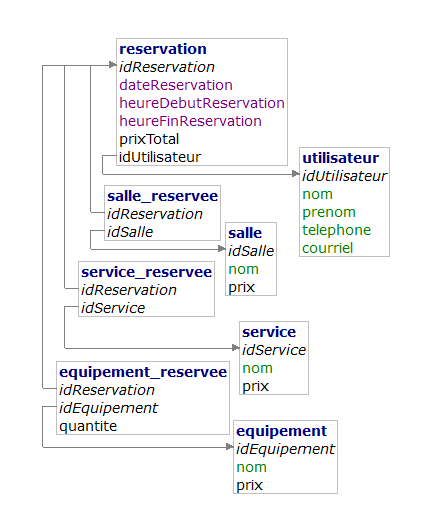

# TP-Projet-RESERVO

```SQL
utilisateur = (idUtilisateur INT, nom VARCHAR(50), prenom VARCHAR(255), telephone CHAR(10), courriel VARCHAR(255));

reservation = (idReservation INT, dateReservation DATE, heureDebutReservation TIME, heureFinReservation TIME, prixTotal INT, #idUtilisateur);

salle = (idSalle INT, nom VARCHAR(100), superficie INT, prix INT);

equipement = (idEquipement INT, nom VARCHAR(150));

service = (idService INT, nom VARCHAR(150));

salle_reservee = (#idReservation, #idSalle);

equipement_reservee = (#idReservation, #idEquipement);

service_reservee = (#idReservation, #idService);
```

## TODO

- [ ] Faire une page facture 
- [ ] ajouter regex
- [ ] modifier DB
- [ ] ...

.